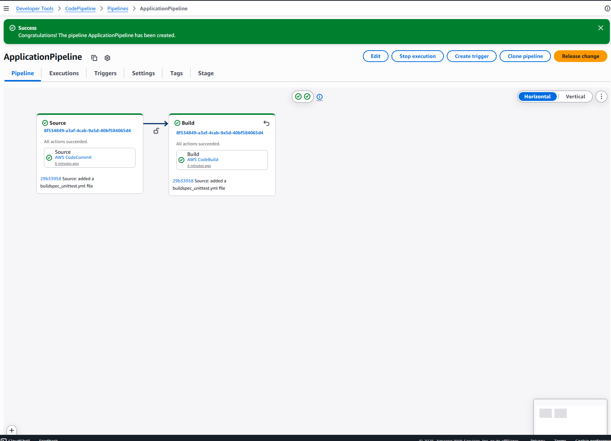
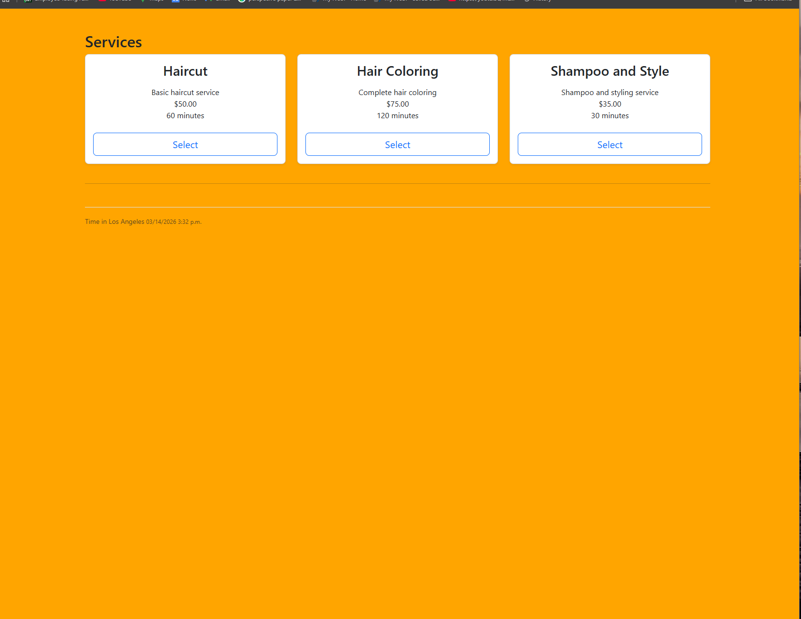
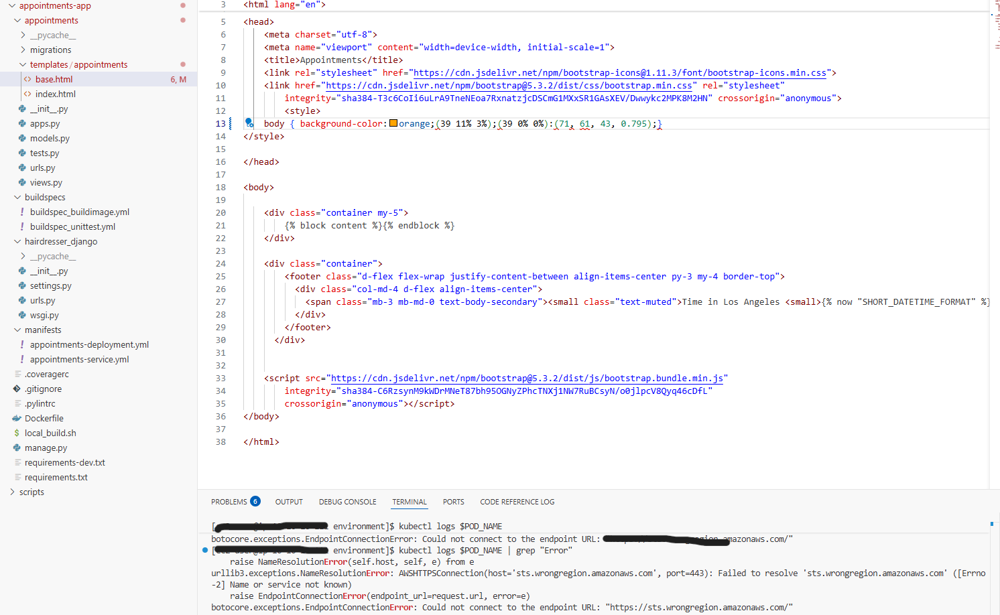
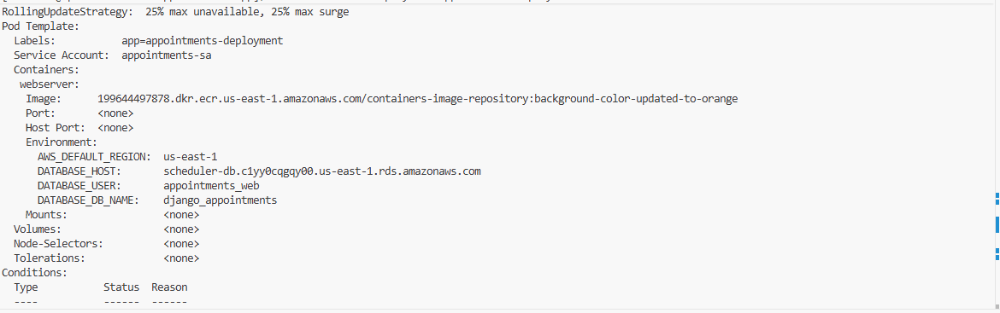
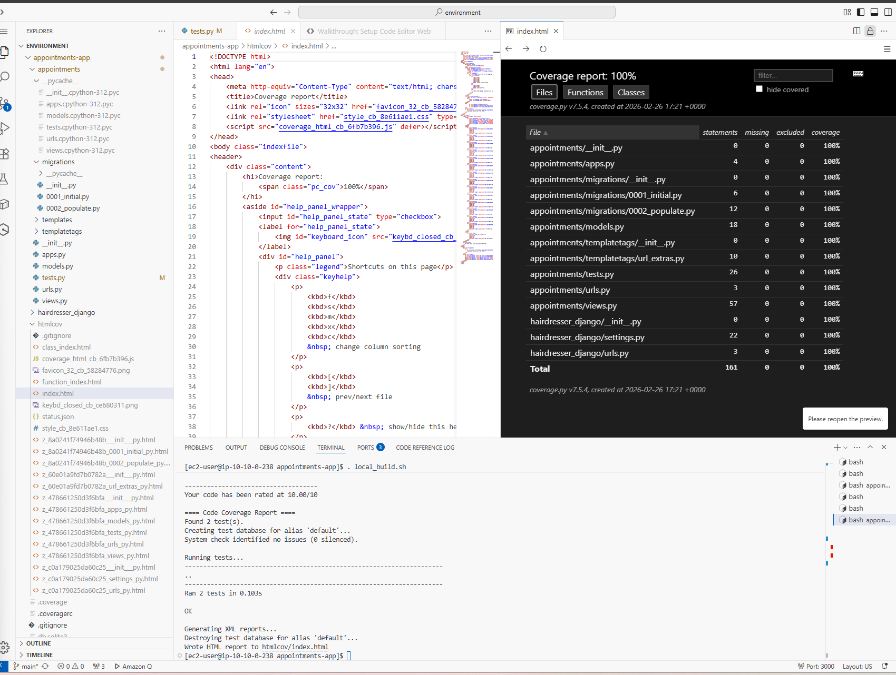
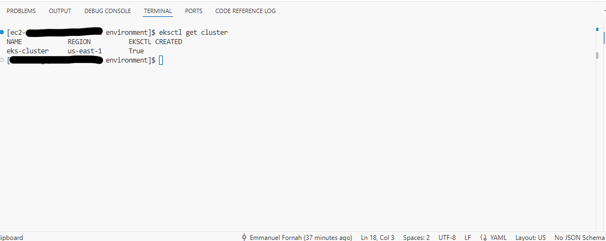

# Deployment Evolution — from EKS to EC2 Blue/Green, for Real

A cloud-native appointment scheduling platform (Python/Django, Docker,
Amazon RDS + DynamoDB) that was **built twice, on purpose**: first on
Amazon EKS to prove Kubernetes CI/CD end-to-end, then migrated to EC2 +
CodeDeploy blue/green after a real cost/traffic review showed the
control-plane cost bought no HA guarantee this workload needed. Both
phases are real, evidenced, and documented below — this isn't a redo,
it's the same engineering judgment call a team makes when a system
outgrows (or never needed) its original compute choice.

**Status key**, used consistently through this README:
- ✅ **Live** — deployed right now, linked, verifiable
- 📐 **Designed, not built** — reasoning + runbook exist, nothing deployed
- 🗄️ **Built, verified, then torn down** — proven once, not left running (cost)

**Portfolio context:** this project concludes a chain that starts in
[`aws-solutions-portfolio`](https://github.com/emmanuelfornah/aws-solutions-portfolio)
(45+ AWS Cloud Institute coursework projects — the breadth this was
built from), continues in
[`aws-compute-evolution`](https://github.com/emmanuelfornah/aws-compute-evolution)
(the same EC2-vs-EKS tradeoff argued generally, across five compute
paradigms on one small app), and lands here — that same tradeoff played
out for real, at production stakes, on a live app with a real cost
delta and real incidents. This repo is the deep dive; the other two are
the breadth and the general case it's an instance of.

---

## ✅ Live right now

**[https://appointments.emmanuelfornah.com](https://appointments.emmanuelfornah.com)**

- AWS CodePipeline: GitHub (CodeStarSourceConnection) → CodeBuild (unit
  tests) → CodeBuild (ARM64 Docker build) → CodeDeploy (blue/green to
  EC2, Graviton/t4g)
- Amazon RDS MySQL, IAM database authentication — no password in app
  code or config
- Amazon DynamoDB for salon announcements
- Application Load Balancer, Route 53 alias record, ACM-issued TLS
- No SSH anywhere — access via SSM Session Manager only, IMDSv2 enforced
- Every IAM policy scoped to a specific resource ARN, least-privilege throughout

Getting from a clean `terraform apply` to this actually being live took
7 distinct, real bugs — IAM permission gaps CloudTrail had to reveal,
an IMDS hop-limit issue specific to Docker, an RDS IAM-auth port bug
buried in a third-party library. Full write-up: `DEPLOYMENT_CODEBUILD.md`
(private notes — the public version of these stories lives in interview
conversation, not this README).

## Architecture (current, EC2 phase)

| Layer | Implementation |
|---|---|
| Compute | EC2 (Graviton/t4g), 2 instances across 2 AZs; CodeDeploy owns the Auto Scaling Group after first deploy (see note below) |
| Load balancing | Application Load Balancer, internet-facing, health-checked target group, HTTP→HTTPS redirect |
| DNS / TLS | Route 53 alias record → the ALB, ACM-issued certificate — `appointments.emmanuelfornah.com` over valid HTTPS |
| Networking | Custom VPC, 3-tier subnet layout (public / app / data) across 2 AZs, security groups chained internet → ALB → app → RDS with no tier skipped, VPC Flow Logs |
| Deployment | AWS CodeDeploy, blue/green with traffic control — new revision health-checked before taking production traffic |
| Backend | Python 3.11, Django 5.0 |
| Relational data | Amazon RDS MySQL — IAM database authentication, encrypted at rest |
| NoSQL data | Amazon DynamoDB (salon announcements) — encrypted, point-in-time recovery |
| Secrets | AWS Secrets Manager for the one app secret; RDS master credential generated/rotated by RDS itself |
| Access | SSM Session Manager only, IMDSv2 enforced |
| CI/CD | GitHub → CodePipeline (CodeStarSourceConnection) → CodeBuild → CodeBuild → CodeDeploy |

**Note on the ASG:** CodeDeploy's blue/green model (`COPY_AUTO_SCALING_GROUP`)
doesn't scale the original ASG to zero after a deploy — it deletes it
and creates a new one every time. Terraform owns the launch template;
CodeDeploy owns the live ASG identity. This is why seasonal
auto-scaling schedules (below) are currently disabled rather than
quietly broken.

## 🗄️ Phase 1 — EKS (built, verified, torn down)

The original build proved the same application on Kubernetes: AWS
CodeCommit → CodePipeline → CodeBuild → `kubectl apply` → EKS, ALB
ingress via the AWS Load Balancer Controller, a real production
incident (pod crash from a region misconfiguration, diagnosed via
`kubectl logs` and fixed in minutes), and a demonstrated rollback via
both `kubectl rollout undo` and `git revert`. Full screenshot evidence —
CI/CD stages, coverage reports, the rollback sequence, the EKS cluster
itself — is preserved in `screenshots/`.

This was deliberately torn down after verification (EKS's ~$73/mo
control-plane charge doesn't make sense to run continuously for a demo
project) rather than left live — the same cost-discipline that later
drove the migration decision below.

| Pipeline — all 4 stages green | Rollout history → rollback executed |
|---|---|
|  |  |

| Pod crash — region misconfiguration | Fixed and redeployed |
|---|---|
|  |  |

| 100% test coverage | EKS cluster verified |
|---|---|
|  |  |

Full 30-image set (every CI/CD stage, both rollback methods, ALB
migration): [`screenshots/`](screenshots/).

> **Evidence gap, stated plainly:** the EC2/blue-green phase above is live
> and verifiable by visiting the URL directly, but doesn't yet have its
> own screenshot set the way the EKS phase does — that's a real gap, not
> an oversight, and worth closing (a green pipeline run, the CodeDeploy
> blue/green console view, the live app) before this README is considered
> finished.

## Why the migration (EKS → EC2)

- EKS's control plane is a fixed ~$0.10/hr (~$73/mo) charge regardless
  of traffic — for low, bursty appointment-booking traffic, that line
  bought no HA guarantee an ASG + ALB doesn't already provide.
- The migration kept the same VPC, IAM posture, and HA characteristics
  (multi-AZ, self-healing, zero-downtime blue/green) while cutting
  estimated run cost from ~$180-220/mo to ~$50-70/mo.
- Kubernetes competency is still demonstrated and evidenced (Phase 1,
  above) — this isn't "EKS is bad," it's recognizing when a simpler,
  cheaper architecture serves the same workload equally well. See
  [`aws-compute-evolution`](https://github.com/emmanuelfornah/aws-compute-evolution)
  for that same tradeoff argued generally, across five compute models.

## 📐 Designed, not built

- **Cross-region DR** — pilot-light design (`us-east-2` primary /
  `us-west-2` DR): RDS cross-region read replica, DynamoDB Global
  Table, ECR replication, idle standby ASG, Route 53 failover. Target
  RTO ~10-20 min, RPO seconds-to-minutes. Deliberately built on demand
  (near an actual interview date), not left running — see
  `DR_RUNBOOK.md` and `DR_SCENARIO.md` for the full design and the
  reasoning behind the region pairing.
- **Seasonal auto-scaling** — two scheduled capacity actions were
  written, then found to conflict with CodeDeploy's ASG-replacement
  behavior and disabled pending a Lambda-based redesign that can look
  up the current live ASG dynamically instead of naming it statically.
- **CloudWatch monitoring stack** — agent-based disk/memory metrics,
  threshold alarms, SNS notification — in progress.

## Security posture

- Every IAM policy scoped to a specific resource ARN except the one
  AWS action with no resource-level scoping (`ecr:GetAuthorizationToken`)
- IAM database authentication — no long-lived DB password
- Immutable ECR image tags — a deployed image reference can't be
  silently repointed
- IMDSv2 enforced, EBS encrypted, images scanned on push
- STRIDE threat model documented in `SECURITY.md`

## Cost posture

Cost was treated as a first-class design constraint here, not a
line-item review after the fact — every major decision on this list was
made by weighing dollar cost against the HA/functionality it actually
bought:

- **The EKS→EC2 migration itself** — the single biggest line item. EKS's
  fixed ~$73/mo control-plane charge bought no HA guarantee an ASG + ALB
  doesn't already provide at this traffic level; see
  [Why the migration](#why-the-migration-eks--ec2) above.
- **Graviton (t4g) instances** — better price-performance than
  equivalent x86 instances for this workload; the BuildImage CodeBuild
  project builds natively for ARM64 rather than paying the
  cross-compilation cost to still end up on the more expensive family.
- **gp3 over gp2/io-family EBS** — cheaper per-GB with better baseline
  IOPS than gp2, no reason to pay for a higher storage tier this
  workload doesn't need.
- **Single-AZ RDS by default** — Multi-AZ RDS roughly doubles the
  database cost; not turned on here because the compute tier already
  provides multi-AZ HA and the DB isn't the current availability
  bottleneck. A real production system with a stricter RPO would revisit
  this specific tradeoff, not apply it blindly.
- **DR kept pilot-light and build-on-demand, not always-on** — the full
  cross-region design exists (`DR_RUNBOOK.md`) but isn't running, because
  paying for a warm standby 24/7 isn't justified without a concrete
  reason to demo or actually fail over to it.
- **AWS Cost Optimization Hub enabled** — ongoing, automated
  recommendation visibility rather than a one-time cost review.
- **Seasonal auto-scaling** (currently disabled pending the Lambda
  redesign noted above) — was designed to trim burst *capacity* down in
  the slow season while keeping the HA floor (`min_size=2`) untouched,
  the same "cut cost without cutting availability" principle as the
  core migration, just at a smaller scale.

| | EKS (Phase 1, torn down) | EC2 (Phase 2, live) |
|---|---|---|
| Control plane | ~$73/mo | $0 |
| Compute (multi-AZ) | ~$60/mo | ~$15-30/mo |
| NAT | ~$32/mo (or ~$3/mo NAT instance) | same |
| ALB | ~$20/mo | ~$20/mo |
| RDS (single-AZ, small) | ~$15/mo | ~$15/mo |
| **Total (estimated)** | **~$180-220/mo** | **~$50-70/mo** |

## Local development

Supports both local SQLite (default) and RDS via environment
variables — see `hairdresser_django/settings.py`.
